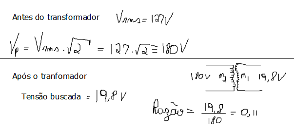
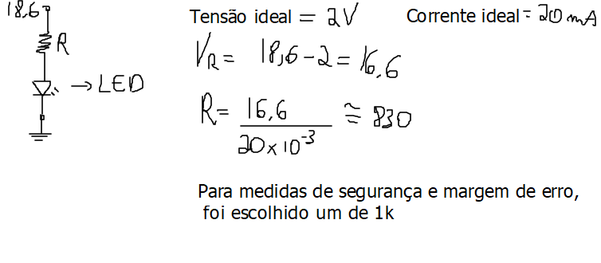
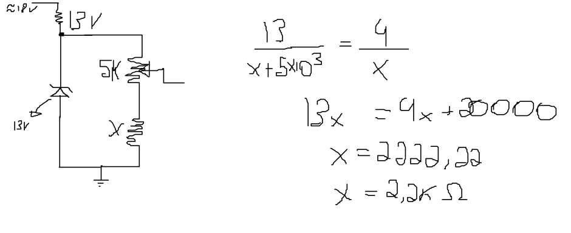

# Projeto Fonte de Tensão ajustável
##### Esse projeto tem por finalidade a montagem de uma fonte de tensão ajustável, variando de 3V até 12V, chegando aos 100mA.

# Componentes utilizados e seus preços
| Quantidade | Componnetes       | Preço (R$) | Unidades | P/ Total                                   |
| ----------:| ------------------| ----------:| --------:| ------------------------------------------:|
|      1     | Diodo Zener       |     9,90   |    10    |    [0,99](https://tinyurl.com/u995ytx4)    |
|      1     | Capacitor (470uF) |     0,81   |     1    |    [0,81](https://tinyurl.com/a4569se8)    |
|      1     | LED (Vermelho)    |     0,23   |     1    |    [0,23](https://tinyurl.com/32bxy5f6)    |
|      1     | Resistor 1k       |     0,14   |     1    |    [0,14](https://tinyurl.com/8ce83965)    |
|      1     | Resistor 2.2k     |    12,15   |    15    |    [0,81](https://tinyurl.com/7rjcf57y)    |
|      1     | Resistor 1.5k     |     0,14   |     1    |    [0,14](https://tinyurl.com/x8dz2z89)    |
|      4     | Diodo             |     0,12   |     1    |    [0,14 * 4](https://tinyurl.com/2t5vttyc)|
|      1     | Potenciômetro     |     1,70   |     1    |    [1,70](https://tinyurl.com/5f35a4k7)    |
|      1     | Transistor        |     0,21   |     1    |    [0,21](https://tinyurl.com/x69r8r28)    |
|      1     | Fusível (0.5A)    |     0,18   |     1    |    [0,18](https://tinyurl.com/3sz9uz65)    |

## Contas do transformador

## Contas para escolha do resistor em série ao LED

## Foi escolhido um Diodo Zener de 13V, pois com a queda de tensão do transistor ficava muito próximo de 12V na saída, o que era exatamente o que queríamos.

## Contas do potenciômetro e o resistor em série 

